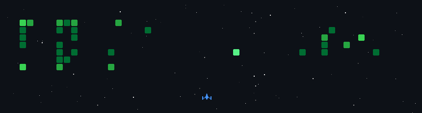

  

  

## 📌 About Me

- 🎓 Final Year CS undergrad at **IIT Patna**
- 🎯 Obsessed with **frontend animations** — gunning for that Awwwards nomination
- 💼 Actively taking on freelance clients — let's build something great together

## 🌐 Portfolio

### Bored of boring websites?

*Experience an Awwwards-nominee-capable site — designed, animated & coded by me.*

 

## 🛠️ Languages & Tools

### 💻 Programming Languages

  

### 🎨 Frontend

  

### ⚙️ Backend

  

### 🗄️ Database

  

### ☁️ DevOps & Cloud

  

### 🔧 Tools

  

  

## 📊 GitHub Stats & Trophies

  
  

  

  

## 🔗 Connect with Me

  
  
  
  

  

